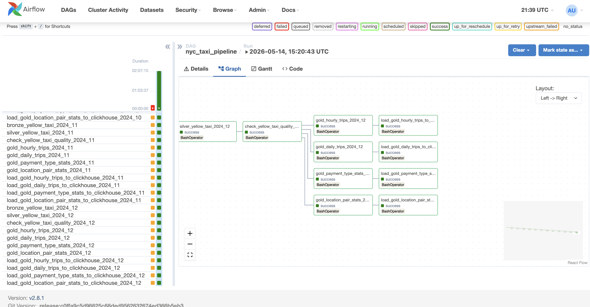
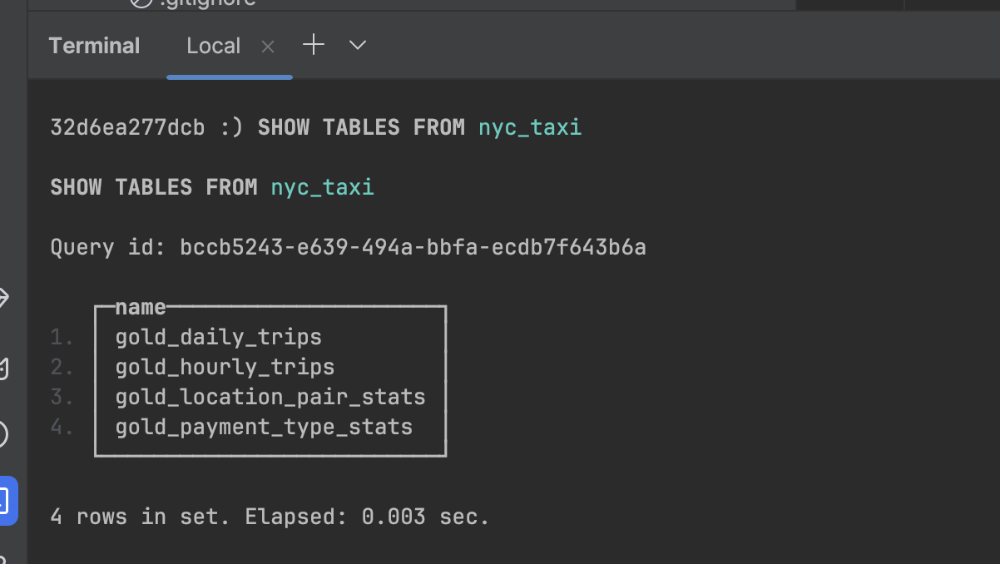
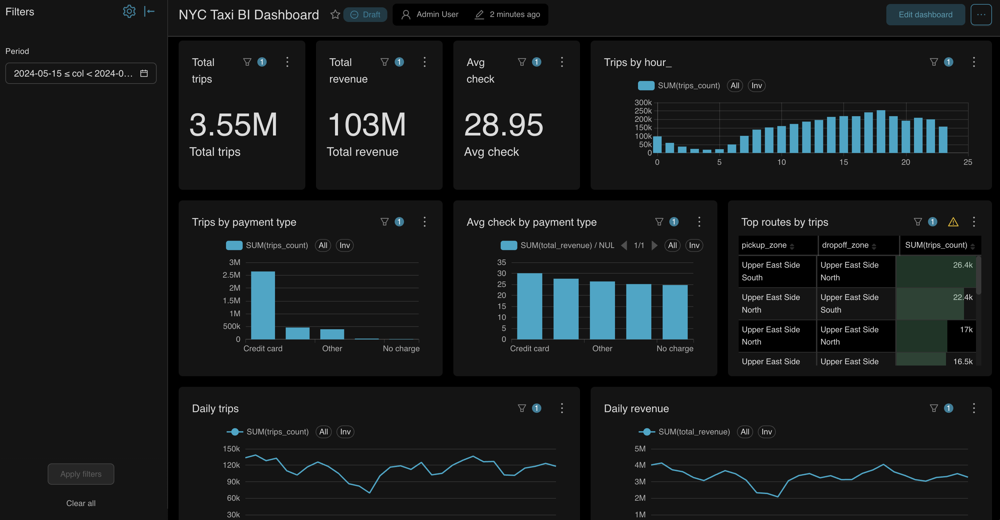

# NYC Taxi Data Engineering Pipeline

End-to-end data engineering project for processing NYC Yellow Taxi trip data using a medallion architecture, Apache Spark ETL jobs, Airflow orchestration, ClickHouse as an analytical serving layer, and Apache Superset for BI dashboards.

The pipeline processes NYC Yellow Taxi data for the full year 2024 and builds analytical marts for trips, revenue, hourly demand, payment behavior, and popular pickup/dropoff routes.

## Project Overview

The goal of this project is to build a production-like batch data pipeline for NYC Taxi data.

The pipeline ingests raw taxi trip data from S3-compatible object storage, cleans and validates the data, builds business-ready analytical marts, loads them into ClickHouse, and exposes the results through a Superset BI dashboard.

This project demonstrates core data engineering practices:

- batch data processing with Apache Spark;
- medallion architecture: raw, bronze, silver, gold;
- workflow orchestration with Apache Airflow;
- data quality checks and validation gates;
- analytical storage with ClickHouse;
- BI visualization with Apache Superset;
- Docker-based local infrastructure;
- centralized configuration and reusable path helpers;
- full-year historical data processing.

## Business Value

The resulting BI dashboard helps analyze NYC Yellow Taxi operations across the full year 2024.

The dashboard answers questions such as:

- how many trips were completed during a selected period;
- how total revenue changed over time;
- what hours have the highest taxi demand;
- which payment types are most commonly used;
- which pickup and dropoff zones form the most popular routes;
- how average check differs by payment type and route.

This type of pipeline can be used as a foundation for transportation analytics, demand monitoring, revenue analysis, and operational reporting.

## Tech Stack

- Python
- Apache Spark / PySpark
- Apache Airflow
- ClickHouse
- Apache Superset
- Docker / Docker Compose
- SQL
- Parquet
- S3-compatible Object Storage

## Architecture

```text
S3-compatible Object Storage
        │
        ▼
Raw Layer
        │
        ▼
Bronze Layer
        │
        ▼
Silver Layer + Data Quality Checks
        │
        ▼
Gold Analytical Marts
        │
        ▼
ClickHouse Serving Layer
        │
        ▼
Superset BI Dashboard
```

The pipeline follows a medallion architecture:

```text
raw → bronze → silver → gold → ClickHouse → Superset
```

## Project Structure

```text
nyc_taxi_final_project/
├── dags/
│   └── nyc_taxi_pipeline.py
├── jobs/
│   ├── config.py
│   ├── bronze_yellow_taxi.py
│   ├── create_clickhouse_gold_tables.py
│   ├── silver_yellow_taxi.py
│   ├── check_yellow_taxi_quality.py
│   ├── gold_daily_trips.py
│   ├── gold_hourly_trips.py
│   ├── gold_location_pair_stats.py
│   ├── gold_payment_type_stats.py
│   ├── check_gold_schema.py
│   ├── load_gold_daily_trips_to_clickhouse.py
│   ├── load_gold_hourly_trips_to_clickhouse.py
│   ├── load_gold_location_pair_stats_to_clickhouse.py
│   ├── load_gold_payment_type_stats_to_clickhouse.py
│   └── truncate_clickhouse_gold_tables.py
├── data/
├── docs/
├── screenshots/
├── superset/
├── tests/
│   ├── test_config.py
│   └── test_dag.py
├── Dockerfile
├── docker-compose.yml
├── .env.example
└── README.md
```

## Data Source

The project uses NYC Yellow Taxi trip records in Parquet format.

The raw data is stored in S3-compatible object storage using the following structure:

```text
nyc_taxi/raw/yellow/year=2024/month=01/yellow_tripdata_2024-01.parquet
nyc_taxi/raw/yellow/year=2024/month=02/yellow_tripdata_2024-02.parquet
...
nyc_taxi/raw/yellow/year=2024/month=12/yellow_tripdata_2024-12.parquet
```

A taxi zone lookup file is also used to enrich pickup and dropoff location IDs with readable zone names:

```text
nyc_taxi/raw/lookup/taxi_zone_lookup.csv
```

## Data Pipeline

### Raw Layer

The raw layer contains the original NYC Yellow Taxi trip data in Parquet format.

### Bronze Layer

The bronze layer is created by:

```text
jobs/bronze_yellow_taxi.py
```

This layer stores ingested source data with minimal transformations and technical metadata.

Main additions:

- load timestamp;
- source system;
- source year;
- source month.

### Silver Layer

The silver layer is created by:

```text
jobs/silver_yellow_taxi.py
```

This layer contains cleaned and standardized taxi trip data.

Typical transformations include:

- calculating trip duration;
- extracting pickup date;
- extracting pickup hour;
- extracting pickup month;
- classifying trips into short, medium, and long;
- removing invalid records;
- writing bad records separately;
- writing a quality report.

The silver layer is partitioned by year and month.

### Gold Layer

The gold layer contains business-ready analytical marts.

Gold jobs:

```text
jobs/gold_daily_trips.py
jobs/gold_hourly_trips.py
jobs/gold_location_pair_stats.py
jobs/gold_payment_type_stats.py
```

Each gold mart is written to S3-compatible object storage and then loaded into ClickHouse.

## Data Quality Checks

The project includes data quality and validation jobs:

```text
jobs/check_yellow_taxi_quality.py
jobs/check_gold_schema.py
```

### Silver Data Quality Checks

The silver job validates records using checks such as:

- pickup datetime is not null;
- dropoff datetime is not null;
- dropoff datetime is greater than pickup datetime;
- trip distance is positive;
- fare amount is not negative;
- total amount is not negative;
- passenger count is valid;
- trip duration is positive and not unrealistically long;
- trip distance is not an extreme outlier;
- pickup date belongs to the expected processing month.

The monthly pickup date check prevents records from a wrong date range from entering the silver layer.

For example, when processing January 2024, the allowed pickup date range is:

```text
2024-01-01 <= pickup_date < 2024-02-01
```

Invalid records are written to the bad records layer.

### Gold Validation

The gold schema check validates that gold marts were successfully written and can be read by Spark.

## Gold Marts

The following gold marts are created and loaded into ClickHouse.

### `gold_daily_trips`

Daily trip metrics.

Main fields:

- `pickup_date`
- `trips_count`
- `total_revenue`
- `avg_check`
- `avg_trip_distance`
- `avg_trip_duration_minutes`
- `short_trips_count`
- `medium_trips_count`
- `long_trips_count`

Main use cases:

- daily trip volume;
- daily revenue;
- average check;
- average trip distance;
- average trip duration;
- trip type distribution.

### `gold_hourly_trips`

Hourly demand analytics.

Main fields:

- `pickup_date`
- `pickup_hour`
- `trips_count`
- `total_revenue`
- `avg_check`
- `avg_trip_distance`
- `avg_trip_duration_minutes`

Main use cases:

- trips by hour of day;
- demand distribution throughout the day;
- peak hour analysis;
- hourly revenue analysis.

### `gold_location_pair_stats`

Pickup and dropoff location pair statistics.

Main fields:

- `pickup_date`
- `pickup_location_id`
- `pickup_zone`
- `pickup_borough`
- `pickup_service_zone`
- `dropoff_location_id`
- `dropoff_zone`
- `dropoff_borough`
- `dropoff_service_zone`
- `trips_count`
- `total_revenue`
- `avg_check`
- `avg_trip_distance`
- `avg_trip_duration_minutes`

Main use cases:

- top routes by number of trips;
- top routes by revenue;
- route-level demand analysis;
- pickup/dropoff zone analysis.

### `gold_payment_type_stats`

Payment type analytics.

Main fields:

- `pickup_date`
- `payment_type`
- `payment_type_name`
- `trips_count`
- `total_revenue`
- `avg_check`
- `total_tips`
- `avg_tip`
- `tips_share_from_revenue`

Main use cases:

- trips by payment type;
- revenue by payment type;
- average check by payment type;
- tips analysis.

## ClickHouse Serving Layer

Gold marts are loaded into the ClickHouse database:

```text
nyc_taxi
```

ClickHouse tables:

```text
nyc_taxi.gold_daily_trips
nyc_taxi.gold_hourly_trips
nyc_taxi.gold_location_pair_stats
nyc_taxi.gold_payment_type_stats
```

Load jobs:

```text
jobs/load_gold_daily_trips_to_clickhouse.py
jobs/load_gold_hourly_trips_to_clickhouse.py
jobs/load_gold_location_pair_stats_to_clickhouse.py
jobs/load_gold_payment_type_stats_to_clickhouse.py
```

Before a full refresh, the DAG runs two ClickHouse preparation steps:

```text
jobs/create_clickhouse_gold_tables.py
jobs/truncate_clickhouse_gold_tables.py
```
The create_clickhouse_gold_tables.py job creates the ClickHouse database and gold tables if they do not already exist.

The truncate_clickhouse_gold_tables.py job clears existing gold table data before a full reload. This prevents duplicate data in ClickHouse when the full-year pipeline is rerun.

ClickHouse is used as an analytical serving layer for fast BI queries from Superset.

## Final ClickHouse Output

After processing the full year 2024, the ClickHouse gold tables contain the following date range:

```text
2024-01-01 → 2024-12-31
```

Final row counts:

```text
gold_daily_trips              366
gold_hourly_trips             8783
gold_payment_type_stats       1830
gold_location_pair_stats      2857013
```

The `gold_location_pair_stats` mart is enriched with readable taxi zone names, for example:

```text
237 → Upper East Side South
236 → Upper East Side North
```

## Airflow Orchestration

The pipeline is orchestrated with Apache Airflow.

DAG file:

```text
dags/nyc_taxi_pipeline.py
```

The DAG processes all months of 2024 and runs the full pipeline:

```text
create ClickHouse gold tables
        │
        ▼
truncate ClickHouse gold tables
        │
        ▼
bronze monthly jobs
        │
        ▼
silver monthly jobs
        │
        ▼
quality checks
        │
        ▼
gold marts
        │
        ▼
load gold marts to ClickHouse
```
The DAG first ensures that all ClickHouse gold tables exist, then truncates them before running.

Airflow is used to manage task dependencies, retries, and execution visibility.

## Superset BI Dashboard

Apache Superset is used as the BI layer.

The dashboard is built on top of ClickHouse gold marts and includes:

- total trips;
- total revenue;
- average check;
- daily trips trend;
- daily revenue trend;
- trips by hour;
- trips by payment type;
- average check by payment type;
- top routes by trips;
- top routes by revenue.

Dashboard name:

```text
NYC Taxi BI Dashboard
```

The dashboard includes a date filter based on `pickup_date`, so all charts can be filtered by reporting period.

## Automated Tests

The project includes automated tests for configuration helpers and Airflow DAG structure.

Test files:

```text
tests/test_config.py
tests/test_dag.py
```
### `test_config.py`

This test module validates project configuration logic:

- monthly date boundary calculation;
- S3/Object Storage path helpers;
- raw, bronze, silver, quality, bad records, and gold layer paths;
- taxi zone lookup path.

### `test_dag.py`

This test module validates Airflow orchestration logic:

- DAG imports without errors;
- `nyc_taxi_pipeline` DAG exists;
- ClickHouse preparation tasks exist;
- monthly tasks for January and December exist;
- total task count is correct;
- `create_clickhouse_gold_tables` runs before `truncate_clickhouse_gold_tables`;
- the first bronze task runs after ClickHouse preparation;
- monthly processing order is preserved;
- gold tasks run before ClickHouse load tasks.

Run tests locally:

```bash
python -m pytest tests -v
```

Run DAG tests inside the Airflow container:

```bash
docker exec -it nyc_taxi_airflow bash -lc '
cd /opt/airflow &&
PYTHONPATH=/opt/airflow/jobs python -m pytest tests -v
'
```

## How to Run Locally

### 1. Configure Environment Variables

Create a local `.env` file using `.env.example` as a template.

Required configuration includes:

- object storage bucket;
- S3-compatible endpoint;
- object storage credentials;
- ClickHouse credentials;
- Airflow admin credentials;
- Superset admin credentials;
- Superset secret key;
- Airflow webserver secret key.

### 2. Start Infrastructure

```bash
docker compose up -d --build
```

This starts:

- PostgreSQL for Airflow metadata;
- Airflow webserver and scheduler;
- ClickHouse;
- Superset.

### 3. Open Airflow

```text
http://localhost:8080
```

Run the DAG:

```text
nyc_taxi_pipeline
```

### 4. Open ClickHouse

ClickHouse HTTP interface:

```text
http://localhost:8123
```

Example query:

```sql
SELECT *
FROM nyc_taxi.gold_daily_trips
LIMIT 10;
```

### 5. Open Superset

```text
http://localhost:8088
```

Open dashboard:

```text
NYC Taxi BI Dashboard
```

If table schemas change, refresh Superset datasets:

```text
Data → Datasets → Edit dataset → Columns → Sync columns from source → Save
```

## Screenshots

### Airflow Successful Pipeline Run



### ClickHouse Gold Tables



### Superset BI Dashboard



## Future Improvements

Possible future improvements:

- add Spark transformation unit tests with small sample datasets;
- add incremental processing by month or partition;
- add more data quality checks;
- add CI/CD pipeline with GitHub Actions;
- add ClickHouse schema migration/versioning approach;
- add dbt layer for analytical transformations;
- improve Superset dashboard cross-filtering;
- add monitoring and alerting for pipeline failures.