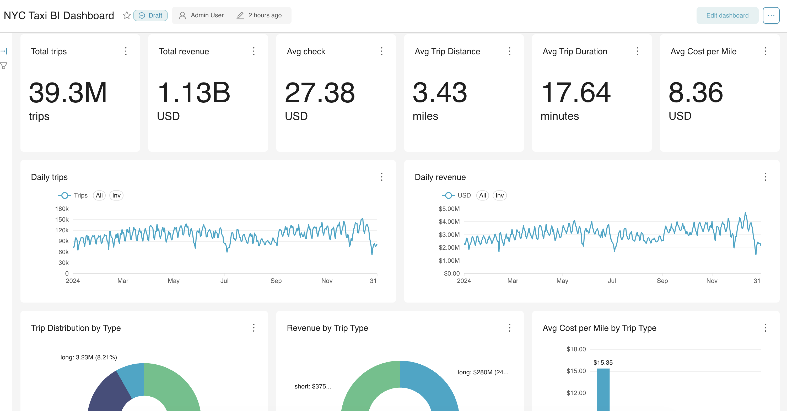
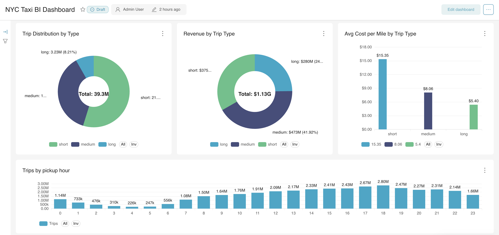
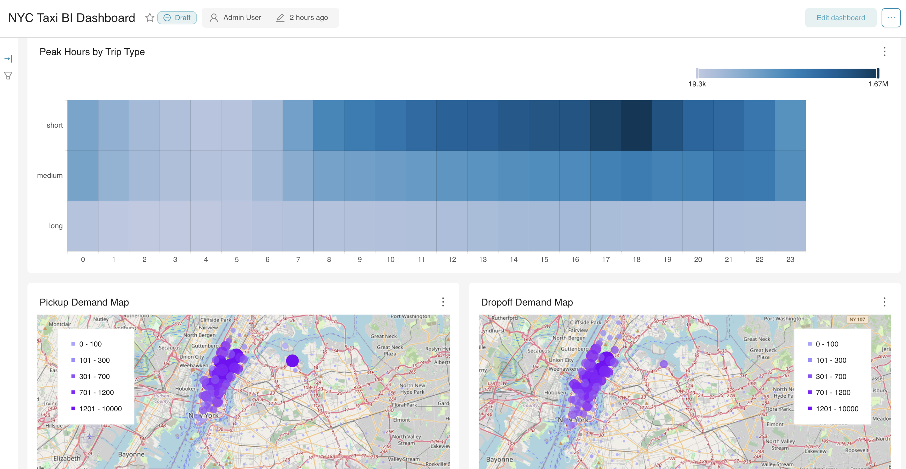
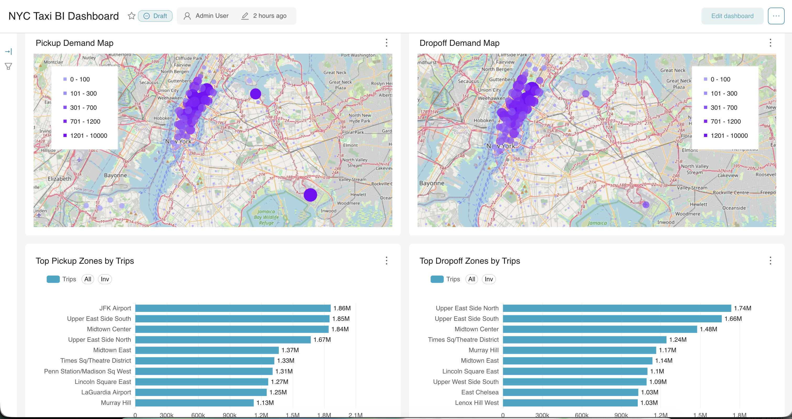
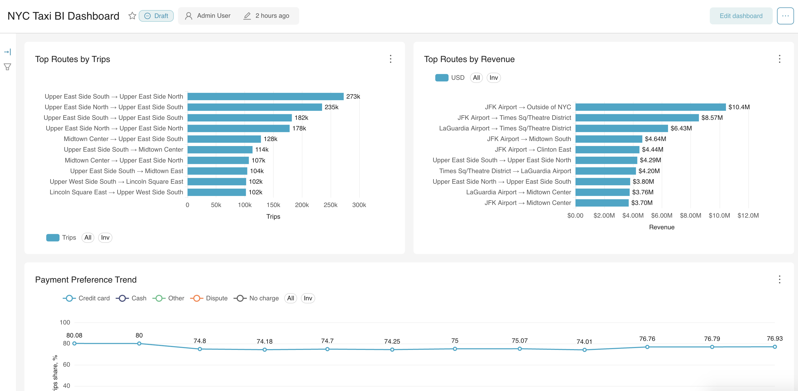
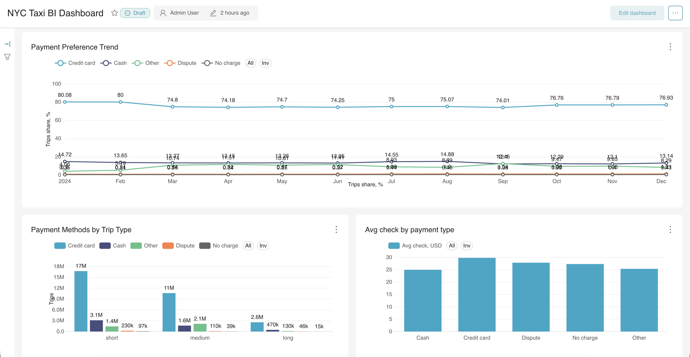
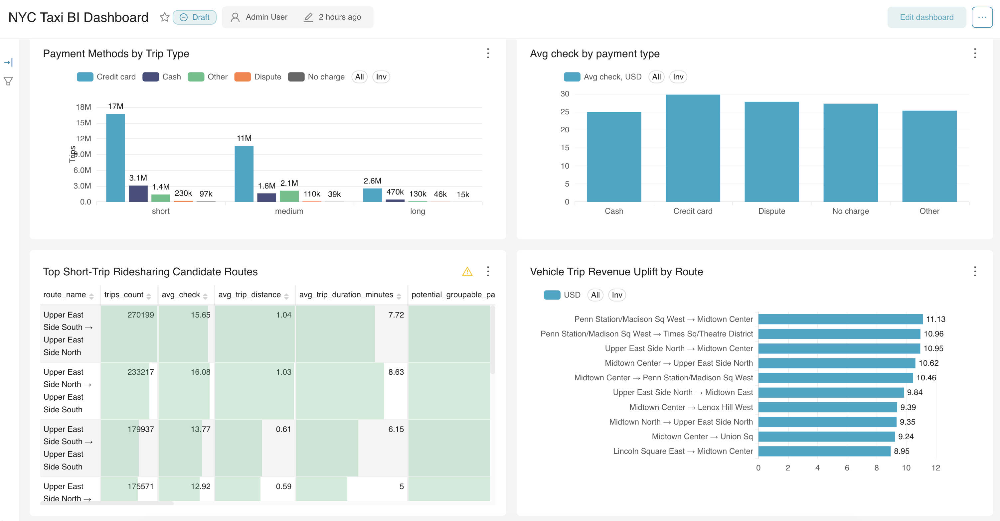

# NYC Taxi Data Engineering Pipeline

End-to-end data engineering project for processing NYC Yellow Taxi trip data using a medallion architecture, Apache Spark ETL jobs, Airflow orchestration, ClickHouse as an analytical serving layer, and Apache Superset for BI dashboards.

The pipeline processes NYC Yellow Taxi data for the full year 2024 and builds analytical marts for trips, revenue, hourly demand, payment behavior, and popular pickup/dropoff routes.

## Project Overview

The goal of this project is to build a production-like batch data pipeline for NYC Taxi data.

The pipeline ingests raw taxi trip data from S3-compatible object storage, cleans and validates the data, builds business-ready analytical marts, loads them into ClickHouse, and exposes the results through a Superset BI dashboard.

This project demonstrates core data engineering practices:

- batch data processing with Apache Spark;
- medallion architecture: raw, bronze, silver, gold;
- workflow orchestration with Apache Airflow;
- data quality checks and validation gates;
- analytical storage with ClickHouse;
- BI visualization with Apache Superset;
- Docker-based local infrastructure;
- centralized configuration and reusable path helpers;
- full-year historical data processing.

## Business Value

The resulting BI dashboard helps analyze NYC Yellow Taxi operations across the full year 2024.

The dashboard answers questions such as:

- how many trips were completed during a selected period;
- how total revenue changed over time;
- what hours have the highest taxi demand;
- which payment types are most commonly used;
- which pickup and dropoff zones form the most popular routes;
- how average check differs by payment type and route.

This type of pipeline can be used as a foundation for transportation analytics, demand monitoring, revenue analysis, and operational reporting.

## Tech Stack

- Python
- Apache Spark / PySpark
- Apache Airflow
- ClickHouse
- Apache Superset
- Docker / Docker Compose
- SQL
- Parquet
- S3-compatible Object Storage

## Architecture

```text
S3-compatible Object Storage
        │
        ▼
Raw Layer
        │
        ▼
Bronze Layer
        │
        ▼
Silver Layer + Data Quality Checks
        │
        ▼
Gold Analytical Marts
        │
        ▼
ClickHouse Serving Layer
        │
        ▼
Superset BI Dashboard
```

The pipeline follows a medallion architecture:

```text
raw → bronze → silver → gold → ClickHouse → Superset
```

## Project Structure

```text
nyc_taxi_final_project/
├── .github/
│   └── workflows/
│       └── ci.yml
├── dags/
│   └── nyc_taxi_pipeline.py
├── jobs/
│   ├── config.py
│   ├── bronze_yellow_taxi.py
│   ├── silver_yellow_taxi.py
│   ├── check_yellow_taxi_quality.py
│   ├── gold_daily_trips.py
│   ├── gold_hourly_trips.py
│   ├── gold_location_pair_stats.py
│   ├── gold_payment_type_stats.py
│   ├── check_gold_schema.py
│   ├── create_clickhouse_gold_tables.py
│   ├── truncate_clickhouse_gold_tables.py
│   ├── check_clickhouse_gold_quality.py
│   ├── load_gold_daily_trips_to_clickhouse.py
│   ├── load_gold_hourly_trips_to_clickhouse.py
│   ├── load_gold_location_pair_stats_to_clickhouse.py
│   ├── load_gold_payment_type_stats_to_clickhouse.py
│   ├── load_taxi_zone_centroids_to_clickhouse.py
│   └── run_clickhouse_sql_file.py
├── tests/
│   ├── test_config.py
│   └── test_dag.py
├── data/
│   └── geo/
│       └── taxi_zone_centroids.csv
├── docs/
│   ├── analytics_summary.md
│   └── nyc_taxi_bi_dashboard.pdf
├── sql/
│   └── analytics/
│       ├── 01_top_pickup_zones.sql
│       ├── 02_top_dropoff_zones.sql
│       ├── 03_peak_hours.sql
│       ├── 04_trip_type_distribution.sql
│       ├── 05_peak_hours_by_trip_type.sql
│       ├── 06_top_zones_by_trip_type.sql
│       ├── 07_payment_methods_by_trip_type.sql
│       ├── 08_payment_preference_trends.sql
│       └── 09_short_trip_ridesharing_opportunities.sql
├── screenshots/
│   ├── airflow_successful_run_graph.png
│   ├── clickhouse_gold_tables.png
│   ├── superset_01_executive_overview.png
│   ├── superset_02_trip_type_and_peak_demand.png
│   ├── superset_03_heatmap_and_geo_maps.png
│   ├── superset_04_geo_demand_zones.png
│   ├── superset_05_routes_and_payment_trends.png
│   ├── superset_06_payment_analytics.png
│   └── superset_07_ridesharing_opportunities.png
├── superset/
├── Dockerfile
├── docker-compose.yml
├── .env.example
└── README.md
```

## Data Source

The project uses NYC Yellow Taxi trip records in Parquet format.

The raw data is stored in S3-compatible object storage using the following structure:

```text
nyc_taxi/raw/yellow/year=2024/month=01/yellow_tripdata_2024-01.parquet
nyc_taxi/raw/yellow/year=2024/month=02/yellow_tripdata_2024-02.parquet
...
nyc_taxi/raw/yellow/year=2024/month=12/yellow_tripdata_2024-12.parquet
```

A taxi zone lookup file is also used to enrich pickup and dropoff location IDs with readable zone names:

```text
nyc_taxi/raw/lookup/taxi_zone_lookup.csv
```

## Data Pipeline

### Raw Layer

The raw layer contains the original NYC Yellow Taxi trip data in Parquet format.

### Bronze Layer

The bronze layer is created by:

```text
jobs/bronze_yellow_taxi.py
```

This layer stores ingested source data with minimal transformations and technical metadata.

Main additions:

- load timestamp;
- source system;
- source year;
- source month.

### Silver Layer

The silver layer is created by:

```text
jobs/silver_yellow_taxi.py
```

This layer contains cleaned and standardized taxi trip data.

Typical transformations include:

- calculating trip duration;
- extracting pickup date;
- extracting pickup hour;
- extracting pickup month;
- classifying trips into short, medium, and long;
- removing invalid records;
- writing bad records separately;
- writing a quality report.

The silver layer is partitioned by year and month.

### Gold Layer

The project follows a medallion-style data lake architecture:

```text
raw → bronze → silver → gold
```

The gold layer follows a Kimball-style analytical mart approach. Each gold table is designed around a clear analytical grain and business process:

- `gold_daily_trips` — daily taxi performance metrics;
- `gold_hourly_trips` — hourly demand and trip type analysis;
- `gold_location_pair_stats` — pickup/dropoff zone and route-level analytics;
- `gold_payment_type_stats` — payment behavior analytics.

This structure makes the final marts suitable for business reporting, ClickHouse analytics, and Superset dashboard visualizations.

Gold jobs:

```text
jobs/gold_daily_trips.py
jobs/gold_hourly_trips.py
jobs/gold_location_pair_stats.py
jobs/gold_payment_type_stats.py
```

Each gold mart is written to S3-compatible object storage and then loaded into ClickHouse.

## Data Quality Checks

The project includes data quality and validation jobs for different pipeline layers:

```text
jobs/check_yellow_taxi_quality.py
jobs/check_gold_schema.py
jobs/check_clickhouse_gold_quality.py
```

### Silver Data Quality Checks

The silver job validates records using checks such as:

- pickup datetime is not null;
- dropoff datetime is not null;
- dropoff datetime is greater than pickup datetime;
- trip distance is positive;
- fare amount is not negative;
- total amount is not negative;
- passenger count is valid;
- trip duration is positive and not unrealistically long;
- trip distance is not an extreme outlier;
- pickup date belongs to the expected processing month;
- `payment_type` is populated and belongs to the expected set of values;
- `PULocationID` and `DOLocationID` are populated and positive;
- derived `pickup_hour` is populated and belongs to the range from `0` to `23`.

These checks strengthen the silver layer contract for downstream gold marts. Payment, location, and pickup hour fields are required for payment analytics, route analytics, and hourly demand analytics.

For example, when processing January 2024, the allowed pickup date range is:

```text
2024-01-01 <= pickup_date < 2024-02-01
```

Invalid records are written to the bad records layer.

### Gold Object Storage Quality Checks

The gold Object Storage check validates that monthly gold marts were successfully written to S3-compatible Object Storage and meet expected quality rules before they are loaded into ClickHouse.

It checks that:

- all gold parquet marts can be read by Spark;
- all required columns are present;
- all gold marts are not empty;
- `pickup_date` values belong to the expected processing month;
- `trip_type` values are populated for hourly, route, and payment marts;
- `pickup_hour` values are valid for `gold_hourly_trips`;
- `payment_type_name` values are not empty for `gold_payment_type_stats`;
- `pickup_zone` and `dropoff_zone` values are not empty for `gold_location_pair_stats`.

This check helps catch issues in the gold parquet layer before data is loaded into the ClickHouse serving layer.

### ClickHouse Gold Quality Checks

The final ClickHouse quality check validates the analytical serving layer after all gold marts have been loaded into ClickHouse.

It checks that:

- all ClickHouse gold tables exist;
- all ClickHouse gold tables are not empty;
- `pickup_date` covers the expected full-year range from `2024-01-01` to `2024-12-31`;
- `trip_type` values are populated for hourly, route, and payment tables;
- `gold_location_pair_stats` has non-empty pickup and dropoff zone names;
- `gold_payment_type_stats` has non-empty payment type names.

This check acts as a final quality gate before the data is considered ready for BI reporting in Superset.

## Gold Marts

The following gold marts are created and loaded into ClickHouse.

### `gold_daily_trips`

Daily trip metrics.

Main fields:

- `pickup_date`
- `trips_count`
- `total_revenue`
- `avg_check`
- `avg_trip_distance`
- `avg_trip_duration_minutes`
- `short_trips_count`
- `medium_trips_count`
- `long_trips_count`

Main use cases:

- daily trip volume;
- daily revenue;
- average check;
- average trip distance;
- average trip duration;
- trip type distribution.

### `gold_hourly_trips`

Hourly demand analytics.

Main fields:

- `pickup_date`
- `trip_type`
- `pickup_hour`
- `trips_count`
- `total_revenue`
- `avg_check`
- `avg_trip_distance`
- `avg_trip_duration_minutes`

Main use cases:

- trips by hour of day;
- demand distribution throughout the day;
- peak hour analysis;
- peak hour analysis by trip type;
- hourly revenue analysis.

### `gold_location_pair_stats`

Pickup and dropoff location pair statistics.

Main fields:

- `pickup_date`
- `trip_type`
- `pickup_location_id`
- `pickup_zone`
- `pickup_borough`
- `pickup_service_zone`
- `dropoff_location_id`
- `dropoff_zone`
- `dropoff_borough`
- `dropoff_service_zone`
- `trips_count`
- `total_revenue`
- `avg_check`
- `avg_trip_distance`
- `avg_trip_duration_minutes`

Main use cases:

- top routes by number of trips;
- top routes by revenue;
- route-level demand analysis;
- route-level demand analysis by trip type;
- pickup/dropoff zone analysis;
- ridesharing opportunity analysis for short nearby trips.

### `gold_payment_type_stats`

Payment type analytics.

Main fields:

- `pickup_date`
- `trip_type`
- `payment_type`
- `payment_type_name`
- `trips_count`
- `total_revenue`
- `avg_check`
- `total_tips`
- `avg_tip`
- `tips_share_from_revenue`

Main use cases:

- trips by payment type;
- revenue by payment type;
- average check by payment type;
- tips analysis;
- payment behavior analysis by trip type;
- payment preference trends over time.

The `trip_type` dimension (`short`, `medium`, `long`) is included in hourly, route, and payment marts to support analytical questions about trip behavior, peak demand by trip type, payment preferences, and ridesharing opportunities.

## ClickHouse Serving Layer

Gold marts are loaded into the ClickHouse database:

```text
nyc_taxi
```

ClickHouse tables:

```text
nyc_taxi.gold_daily_trips
nyc_taxi.gold_hourly_trips
nyc_taxi.gold_location_pair_stats
nyc_taxi.gold_payment_type_stats
```

Load jobs:

```text
jobs/load_gold_daily_trips_to_clickhouse.py
jobs/load_gold_hourly_trips_to_clickhouse.py
jobs/load_gold_location_pair_stats_to_clickhouse.py
jobs/load_gold_payment_type_stats_to_clickhouse.py
```

Before a full refresh, the DAG runs two ClickHouse preparation steps:

```text
jobs/create_clickhouse_gold_tables.py
jobs/truncate_clickhouse_gold_tables.py
```

The `create_clickhouse_gold_tables.py` job creates the ClickHouse database and gold tables if they do not already exist.

The `truncate_clickhouse_gold_tables.py` job clears existing gold table data before a full reload. This prevents duplicate data in ClickHouse when the full-year pipeline is rerun.

After all monthly gold marts are loaded into ClickHouse, the DAG runs a final quality check:

```text
jobs/check_clickhouse_gold_quality.py
```

This job validates that the ClickHouse serving layer is ready for BI usage:

- all gold tables exist;
- all gold tables are not empty;
- `pickup_date` covers the expected full-year range from `2024-01-01` to `2024-12-31`;
- `trip_type` values are populated in hourly, route, and payment tables;
- enriched pickup and dropoff location names are populated;
- payment type names are populated.

If any of these checks fail, the Airflow DAG fails as well.

ClickHouse is used as an analytical serving layer for fast BI queries from Superset.

## Final ClickHouse Output

After processing the full year 2024, the ClickHouse gold tables contain the following date range:

```text
2024-01-01 → 2024-12-31
```

Final row counts after the full-year pipeline run with the `trip_type` dimension:

```text
gold_daily_trips              366
gold_hourly_trips             26349
gold_payment_type_stats       5490
gold_location_pair_stats      3460697
```

The hourly, payment, and route marts include the `trip_type` dimension:

```text
short
medium
long
```

The `gold_location_pair_stats` mart is enriched with readable taxi zone names, for example:

```text
237 → Upper East Side South
236 → Upper East Side North
```

## Airflow Orchestration

The pipeline is orchestrated with Apache Airflow.

DAG file:

```text
dags/nyc_taxi_pipeline.py
```

The DAG processes all months of 2024 and runs the full pipeline:

```text
create ClickHouse gold tables
        │
        ▼
truncate ClickHouse gold tables
        │
        ▼
bronze monthly jobs
        │
        ▼
silver monthly jobs
        │
        ▼
silver quality checks
        │
        ▼
gold marts
        │
        ▼
gold Object Storage quality checks
        │
        ▼
load gold marts to ClickHouse
        │
        ▼
check ClickHouse gold quality
```
Airflow is used to manage task dependencies, retries, and execution visibility.

The DAG first ensures that all ClickHouse gold tables exist, then truncates them before running the full-year reload.

For each month, the DAG validates gold parquet marts in Object Storage before loading them into ClickHouse.

The final `check_clickhouse_gold_quality` task verifies that the ClickHouse serving layer is complete and ready for Superset reporting.


## Superset BI Dashboard

Apache Superset is used as the BI and analytical visualization layer.

The dashboard is built on top of ClickHouse gold marts and Superset virtual datasets. It provides an executive-level overview of NYC Yellow Taxi performance, demand patterns, payment behavior, geospatial demand concentration, and grouped ride opportunities.

Dashboard name: `NYC Taxi BI Dashboard`.

The exported dashboard PDF is available here: [`docs/nyc_taxi_bi_dashboard.pdf`](docs/nyc_taxi_bi_dashboard.pdf).

This PDF provides a static portfolio-friendly version of the final Superset dashboard.

### Superset Virtual Datasets

Some dashboard charts are based directly on ClickHouse gold marts, while others use Superset virtual datasets.

Virtual datasets are used to prepare chart-specific analytical views without creating additional physical tables in ClickHouse. They include:

- pickup and dropoff zone map datasets with taxi zone centroid coordinates;
- payment preference trend dataset;
- grouped ride opportunity dataset;
- route-level and trip-type analytical views.

For geospatial charts, virtual datasets deduplicate taxi zone centroids to one row per `location_id` before joining them with pickup and dropoff demand. This prevents duplicated metrics for multi-part taxi zones.

The dashboard includes the following analytical sections.

### Executive Overview

KPI cards summarize full-year 2024 performance:

- total trips;
- total revenue;
- average check;
- average cost per mile;
- average trip distance;
- average trip duration.

### Daily Performance

Daily trend charts show:

- daily trips;
- daily revenue.

These charts help identify seasonality, weekly demand patterns, demand drops, and revenue fluctuations.

### Trip Type Analytics

Trip type analytics are based on the `trip_type` dimension:

- `short`;
- `medium`;
- `long`.

The dashboard includes:

- trip distribution by type;
- revenue by trip type;
- average cost per mile by trip type.

This section helps compare trip volume, revenue contribution, and passenger cost efficiency across different distance-based trip segments.

### Peak Demand

Peak demand charts show:

- trips by pickup hour;
- peak hours by trip type.

The heatmap highlights how short, medium, and long trips have different demand patterns throughout the day.

### Demand Geography

Geography-focused charts show:

- top pickup zones by trips;
- top dropoff zones by trips;
- top routes by trips;
- top routes by revenue.

These charts help identify high-demand zones, high-value routes, airport-driven demand, and dense Manhattan pickup/dropoff patterns.

### Geospatial Demand

The dashboard includes map-based visualizations:

- pickup demand map;
- dropoff demand map.

These maps use taxi zone centroid coordinates joined with aggregated pickup and dropoff demand. They help visually identify where taxi demand is geographically concentrated.

### Payment Analytics

Payment analytics include:

- payment preference trend over time;
- payment methods by trip type;
- average check by payment type.

These charts show that card payments dominate across trip types and help monitor changes in payment behavior over time.

### Ridesharing Opportunities

The dashboard includes a dedicated analytical section for grouped ride opportunities:

- top short-trip ridesharing candidate routes;
- vehicle revenue uplift for top short-trip candidates.

This section focuses on high-volume short trips between nearby zones and evaluates grouped ride potential using a simplified business model.

The dashboard includes a date filter based on `pickup_date`, so charts can be filtered by reporting period.

## Geospatial Enrichment

To support map visualizations in Superset, the project includes a taxi zone centroid enrichment step.

The original gold marts contain taxi zone identifiers and readable zone names, but they do not contain geographical coordinates.

To enable pickup and dropoff demand maps, taxi zone geometry was processed into a centroid lookup table:

```text
data/geo/taxi_zone_centroids.csv
```

This file contains:

- `location_id`;
- `borough`;
- `zone`;
- `longitude`;
- `latitude`.

The lookup table is loaded into ClickHouse using:

```text
jobs/load_taxi_zone_centroids_to_clickhouse.py
```

Target ClickHouse table:

```text
nyc_taxi.taxi_zone_centroids
```

Some taxi zones are represented by multiple geometry parts. For example:

- `56` — Corona;
- `103` — Governor's Island / Ellis Island / Liberty Island.

To prevent metric duplication during joins, Superset virtual datasets deduplicate centroids to one row per `location_id` before joining them with pickup and dropoff demand.

## Analytical Questions and Business Recommendations

The project includes a dedicated analytical layer for answering business questions from the original project requirements.

Analytical SQL queries are stored in:

```text
sql/analytics/
```

The analytical summary document is stored in:

```text
docs/analytics_summary.md
```

The analysis covers:

- zones with the highest pickup and dropoff demand;
- peak taxi demand hours;
- trip distribution by `trip_type`;
- peak hours for short, medium, and long trips;
- top pickup and dropoff zones by trip type;
- payment methods by trip type;
- payment preference evolution over time;
- ridesharing opportunities for short nearby trips;
- a simplified economic impact model for grouped short trips.

The analytical summary also includes business recommendations related to zone-based pricing, peak-hour pricing, short-trip promotions, card payment reliability, and grouped rides.

## Automated Tests and CI

The project includes automated tests for configuration helpers and Airflow DAG structure.

Test files:

```text
tests/test_config.py
tests/test_dag.py
```

### `test_config.py`

This test module validates project configuration logic:

- monthly date boundary calculation;
- S3/Object Storage path helpers;
- raw, bronze, silver, quality, bad records, and gold layer paths;
- taxi zone lookup path.

### `test_dag.py`

This test module validates Airflow orchestration logic:

- DAG imports without errors;
- `nyc_taxi_pipeline` DAG exists;
- ClickHouse preparation and quality tasks exist;
- monthly tasks for January and December exist;
- total task count is correct;
- `create_clickhouse_gold_tables` runs before `truncate_clickhouse_gold_tables`;
- the first bronze task runs after ClickHouse preparation;
- monthly processing order is preserved;
- gold tasks run before ClickHouse load tasks;
- gold Object Storage quality check runs after all monthly gold marts and before ClickHouse load tasks;
- final ClickHouse gold quality check runs after all December load tasks.

Run tests locally:

```bash
python -m pytest tests -v
```

Run tests inside the Airflow container:

```bash
docker exec -it nyc_taxi_airflow bash -lc '
cd /opt/airflow &&
PYTHONPATH=/opt/airflow/jobs python -m pytest tests -v
'
```

### GitHub Actions CI

The project uses GitHub Actions to run automated checks on push and pull requests.

Workflow file:

```text
.github/workflows/ci.yml
```

The CI pipeline runs:

- Python syntax check for DAG and job files;
- automated tests with `pytest`;
- Airflow DAG structure tests.

CI command:

```bash
PYTHONPATH=jobs python -m pytest tests -v
```

This helps ensure that changes do not break configuration helpers, Airflow DAG imports, or task dependencies before they are merged into `main`.

## Spark Job Optimization

The Silver Spark job was optimized to reduce repeated Spark actions and improve pipeline stability.

Previously, the Silver job calculated data quality metrics by running a separate `count()` action for each DQ flag. This caused multiple repeated passes over the same monthly dataset and increased the amount of repeated reads from Object Storage.

The optimized version calculates DQ metrics in a single aggregation step.

Main improvements:

- DQ metrics are calculated with one aggregate operation instead of multiple separate `count()` actions;
- repeated Spark actions were reduced;
- repeated reads from Object Storage were reduced;
- `dq_df` is persisted with `StorageLevel.DISK_ONLY` to reduce recomputation without increasing Java heap pressure;
- `silver_df` is not cached in memory to avoid Java heap out-of-memory errors.

As a result, monthly Silver jobs became more stable and, during local testing, completed approximately 2 minutes faster on average.

## How to Run Locally

### 1. Configure Environment Variables

Create a local `.env` file using `.env.example` as a template.

Required configuration includes:

- object storage bucket;
- S3-compatible endpoint;
- object storage credentials;
- ClickHouse credentials;
- Airflow admin credentials;
- Superset admin credentials;
- Superset secret key;
- Airflow webserver secret key.

### 2. Start Infrastructure

```bash
docker compose up -d --build
```

This starts:

- PostgreSQL for Airflow metadata;
- Airflow webserver and scheduler;
- ClickHouse;
- Superset.

### 3. Open Airflow

```text
http://localhost:8080
```

Run the DAG:

```text
nyc_taxi_pipeline
```

### 4. Open ClickHouse

ClickHouse HTTP interface:

```text
http://localhost:8123
```

Example query:

```sql
SELECT *
FROM nyc_taxi.gold_daily_trips
LIMIT 10;
```

### 5. Open Superset

```text
http://localhost:8088
```

Open dashboard:

```text
NYC Taxi BI Dashboard
```

If table schemas change, refresh Superset datasets:

```text
Data → Datasets → Edit dataset → Columns → Sync columns from source → Save
```

## Screenshots

### Superset Dashboard — Executive Overview



### Superset Dashboard — Trip Type and Peak Demand



### Superset Dashboard — Heatmap and Geospatial Maps



### Superset Dashboard — Geospatial Demand and Top Zones



### Superset Dashboard — Routes and Payment Trends



### Superset Dashboard — Payment Analytics



### Superset Dashboard — Ridesharing Opportunities



### Airflow Successful Pipeline Run


### ClickHouse Gold Tables


## Future Improvements

Possible future improvements:

- export and version Superset dashboard configuration;
- add taxi zone polygon-based choropleth maps instead of centroid-based point maps;
- add pipeline monitoring and alerting for failures, long-running Airflow tasks, and Spark job duration anomalies;
- review and further optimize Spark jobs to reduce repeated actions, repeated Object Storage reads, and long-running monthly tasks;
- add Spark transformation unit tests with small sample datasets;
- add incremental processing by month or partition;
- add ClickHouse schema migration/versioning approach;
- add dbt layer for analytical transformations.